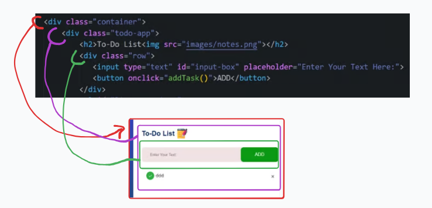
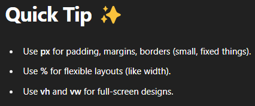
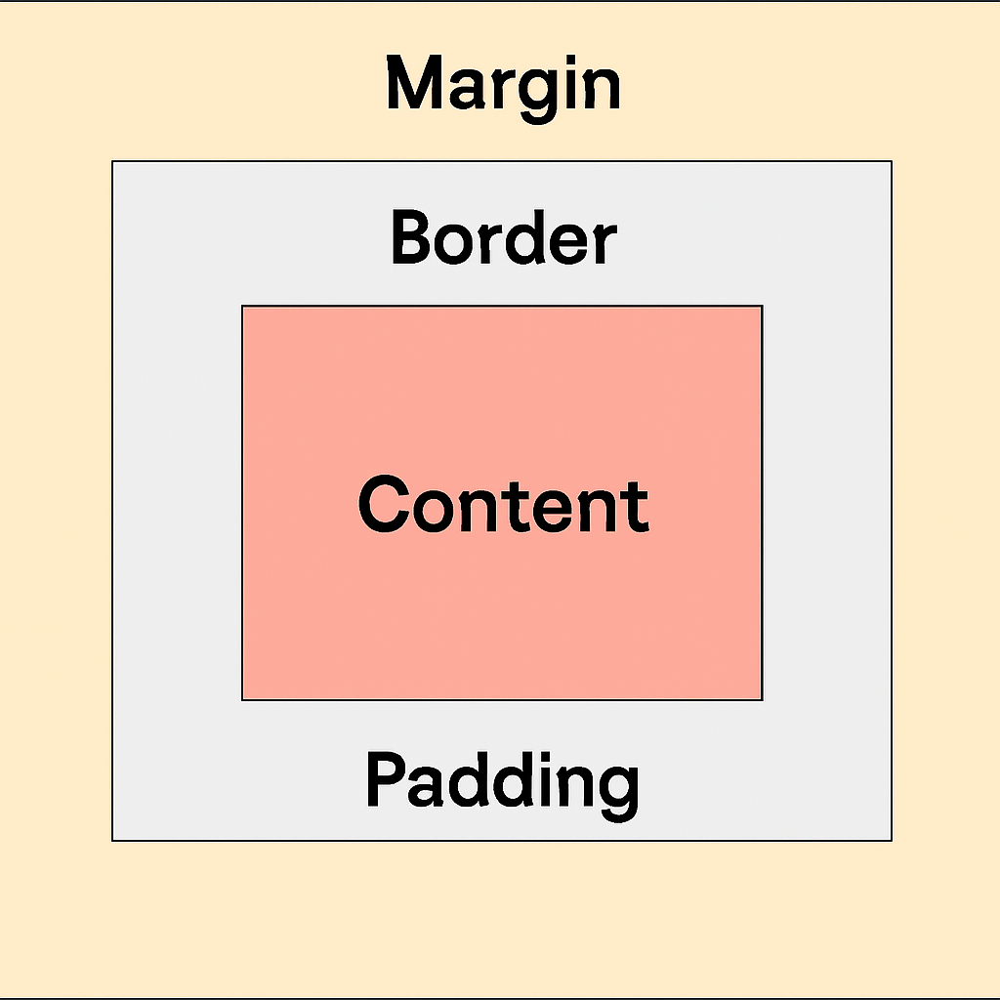
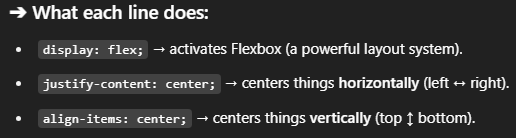

Here's your complete content in proper **Markdown** format:

```markdown
# JavaScript Projects


## Important Notes

### 1. Linking CSS to HTML
Use the `<link>` tag inside the `<head>` section to connect your HTML file to an external CSS file.

**Example:**
```html
<head>
  <link rel="stylesheet" href="styles.css">
</head>
```

- `rel="stylesheet"` tells the browser that this file contains CSS styles.
- `href="styles.css"` specifies the path to your CSS file.

### 2. Linking JavaScript to HTML
Use the `<script>` tag, usually placed right before the closing `</body>` tag, to connect your HTML file to an external JavaScript file.

**Example:**
```html
<body>
  <h1>Hello!</h1>
  <script src="script.js"></script>
</body>
```

- `src="script.js"` specifies the path to your JavaScript file.

### `<div>` Element - Quick Summary



- **Purpose**: The `<div>` element is used to create a **container** or **wrapper** for grouping HTML elements.
- **Block-level**: Takes up the full width by default and starts on a new line.
- **Common Use**: Organizing content, applying styles, creating layouts, and structuring sections of a page.

**Example:**
```html
<div class="container">
  <h1>Welcome</h1>
  <p>This is inside a container.</p>
</div>
```

### 3. Commands

- **`!enter`**: Automatically adds `DOCTYPE` and other boilerplate code.
- **`.row`**: In CSS frameworks like Bootstrap, `.row` is used to create a container for columns and align them properly in a grid layout (inside a `<div>` container).

---

## Button with `onclick` Event

The `<button>` tag creates a clickable button that can trigger JavaScript functions when clicked (in our case, the function `addTask()`).

**Example:**
```html
<button onclick="addTask()">Add Task</button>

<script>
  function addTask() {
    alert('Task Added!');
  }
</script>
```
## Difference between %, vh, and px





## Remember

The `class` attribute is primarily used in HTML to apply styling to elements via CSS. By specifying a class in a tag, you can target that element in your CSS and apply specific styles.

## LASSE9
```css
display: flex;
justify-content: center;
align-items: center;
```
`This combo is the key to putting anything (like an image, text, div...) perfectly in the center (both horizontally and vertically).`


```css
     border-radius: 10px;
    ```
 `border-radius rounds the corners of an element (like a button, a div, an image, etc.).`
